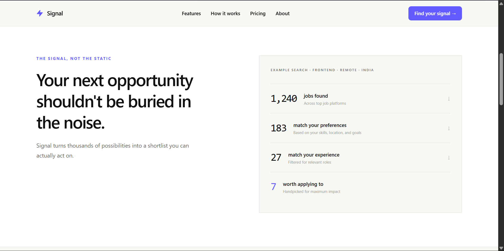
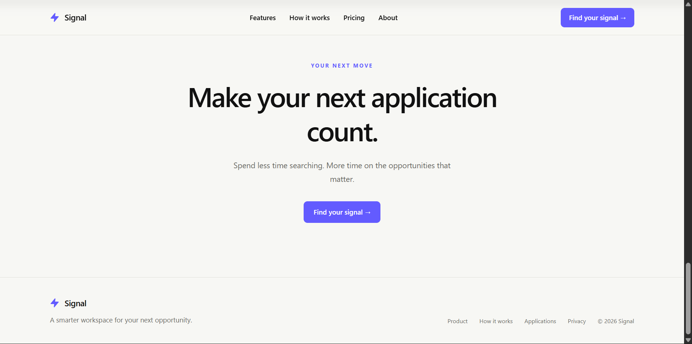

# Signal

Signal is a focused job discovery experience that filters the noise from a large search and surfaces opportunities that fit a candidate's skills, goals, location, and experience.

The interface combines match intelligence, a lightweight application tracker, and a dashboard-style search experience in a responsive single-page application.

## Preview

<table>
  <tr>
    <td></td>
    <td></td>
  </tr>
  <tr>
    <td></td>
    <td></td>
  </tr>
  <tr>
    <td colspan="2"></td>
  </tr>
</table>

## Features

- Dashboard-style job discovery with interactive opportunity selection
- Match scoring with visible strengths and missing criteria
- Application tracking across saved, applied, interview, and offer states
- Responsive layouts for desktop and mobile screens
- Motion-based reveals with reduced-motion support
- Keyboard-triggered Signal pulse interaction

## Tech Stack

- React 19
- Vite
- Tailwind CSS
- Framer Motion
- Oxlint

## Getting Started

### Prerequisites

- Node.js 18 or newer
- npm

### Installation

```bash
npm install
```

### Development

```bash
npm run dev
```

The development server will print the local URL in the terminal.

### Production Build

```bash
npm run build
```

### Linting

```bash
npm run lint
```

## Project Structure

```text
src/
├── components/   Reusable page sections and interface components
├── data/         Demo jobs, applications, and match criteria
├── App.jsx       Application composition and global interaction state
└── index.css     Global styles and Tailwind entry point
assets/           README preview screenshots
public/           Public static assets
```

## License

This project is intended for demonstration and assignment purposes.
